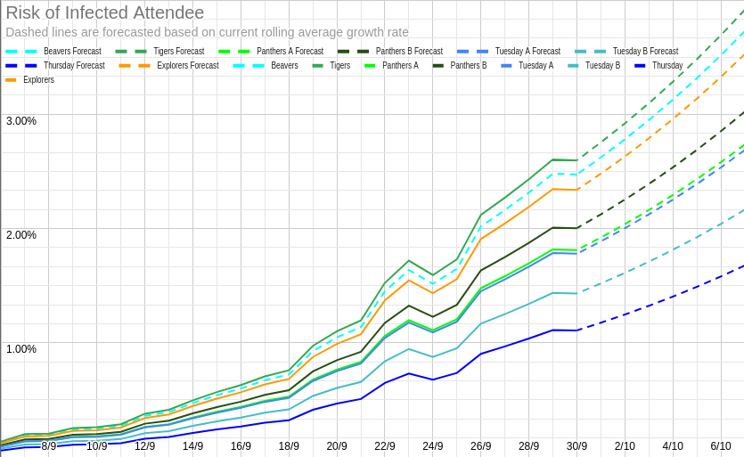

# Covid-19 Risk Update

This update is rather long and detailed - skip to the [last section](#going-forwards) if you just want things going forward, but I would advise you to at least look 
at the [table of risks](#table-of-risks) under "The risks for us specifically", and the [disclaimer following it](#disclaimer-on-the-above-figures).
## The current situation in York

Since we last updated you, cases have risen significantly, both nationally and in York. As of this week, the symptomatic infection rate in 
York (as modelled by [ZOE/KCL](https://covid.joinzoe.com/data) will have broken 5,000 cases per million. This is what the changes since the start of September look 
like: 

(I think that dip on Thursday is a modelling adjustment, rather than an actual change). 

That looks concerning, but there is some good news. Most notably, the rolling average daily growth rate has declined significantly over the last week or so: 

 

That corresponds to a drop in R from ~2 to ~1.3 over the period shown, and an increase in doubling times from 4 days to 12. That suggests that the measures being 
taken are being at least partially effective in York (though this is not as clear elsewhere). 

## The risks for us specifically

So, what does that mean for us? The key number that we've been tracking is the probability of someone arriving at one of our meetings while infected. To calculate 
this, we're using the above overall infection data, adjusting it with the national age case distribution data to match the ages of our members, then adjusting for 
clustering effects (roughly, the more contact your kids have with each other outside of cubs, the more correllated their chances of having it are - for example, 
having both of a pair of siblings is very little additional risk over having just one, because if one of them has it, they've likely already given it to the other - 
we also accounted for school bubbles and other regular close contacts, where we knew about them).

With all of that, we produced some estimated probabilities of someone turning up at each of our meetings while infected, which are shown below, for this week and next 
week (projecting forwards at current growth rates). These are still likely overestimates, for a few reasons: 

1. For Scouts and Explorers specifically, the age data is only grouped into 10-year bands, so you're being lumped in with 18 and 19 year olds, who seem to have 
higher infection rates. 
2. There's some limited evidence that there are fewer infections among children in York than nationally (we've had disproportionately few positive tests in our 
schools, compared to our infection rates). 
3. We don't know about all of your children's contact with each other (this is likely to be a very small effect).

###### Table of Risks 

Section | Risk (This Week) | Risk (Next Week)
--------|-----|------
Beavers | 2.5% | 3.5%
Tigers | 2.4% | 3.5%
Panthers A | 1.9% | 3.3%
Panthers B | 2.1% | 3.7%
Tuesday Scouts A | 1.8% | 2.5%
Tuesday Scouts B | 1.4% | 2.0%
Thursday Scouts | 1.2% | 3.8%
Explorers | 2.5% | 2.9%

Here's how those risks have changed over time, together with (dashed) projections of future risks assuming current growth rates: 

The variation in these figures is due to a few things: 

1. Group size: some of these groups are bigger than others.
1. Beavers/Cubs are lower due to lower infection rates in their age groups. 
2. Meetings with more people at them are higher. 
3. Each meeting has slightly different levels of outside contact with each other. 
4. Especially in the case of Explorers, they're on the other side of the weekend, where we've been consistently seeing significantly higher growth than during the 
week. 

## Disclaimer on the above figures 

I stress that these are the probabilities of someone arriving at a meeting while infected: the chance of someone actually contracting the virus will be significantly 
lower, for a number of reasons: 

1. The attack rates for this virus are just quite low in general - well below 50% even for household contacts (the most plausible explanation going for this
to date is a significant degree of variation in infectivity between cases. As we're essentially only considering asymptomatic/presymptomatic cases, our rates will be
lower than this, even before considering anything below). 
2. We aren't in households - we're meeting outdoors, which very effectively neutralises aerosol transmission (to the point that attempting to apply any of the 
standard aerosol transmission risk assessment processes is hopeless, due to the numbers being absurdly tiny), leaving only fomite and direct transmission. Of these, 
fomite transmission seems to be quite limited, and is quite easy to control, leaving direct transmission as the primary risk factor, and we're meeting for relatively 
short periods (compared to the time spent together in households or schools, for example). 
3. Our attempts at social distancing and other control measures will reduce the risk further. 

It's hard to say exactly how much each of these factors reduces the risk, but in combination, they're likely to be significant. If I had to guess, I'd put the risk
of transmission occurring at around 1% of the above figures. 

## Going forwards

So, what does all of that actually mean? 

- We're still allowed to run - both the government and our own hierarchy are happy for us to continue running for now. 
- We're still happy to keep running, and are of the opinion that, in general, the mental health risks from us stopping remain higher than the risks of transmission. 
- However, those risks are now non-trivial, and we don't feel comfortable leaving you to make the decision as to whether to send your children without knowing as much
as we can tell you about those risks.
- To help you make that decision: 
-- If your child is going to school, the increased risk from also coming to Cubs is far smaller than the risks from that, especially if they're in secondary school.
-- Barring significant comorbidities, the risks of significant illness for your children remain very small (very likely lower than a normal meeting in flu season, 
due to a mixture of flu being more dangerous to children that Covid-19, a lower current prevalence, and our mitigation measures).
-- If they/you/other close contacts are vulnerable in some way, the above might not apply to you. We can't tell you what an acceptable level of risk is - that's a 
decision that only you can make - but if you want me to crunch some numbers to come up with my best estimate of what the risks are, I'm happy to do so. 

We are going to keep meeting for now, and we'll be keeping those figures up to date. If those percentages get worryingly high (around the 10% mark), we'll start dropping our maximum numbers by splitting groups down more where we can, and we'll consider other options where we can't. That will need more reliance on parent helpers to make it work. At current growth rates, that will happen in 2 or 3 weeks, but obviously anything could change in that time. 

Please don't feel under any pressure to send your child or not based on anything other than your own risk/benefit decision. We're not going to be offended if you 
decide not to send them. 

If you do decide to stop sending them:

1. We are still running online meetings over Zoom on Wednesdays, if they want to join us for a chat. Due to low numbers, these have been mostly just chatting and 
playing some games recently, but if we start getting more people, we will start doing more of an actual programme. 
2. Please let us know, so we know what the demand is likely to be for non-face-to-face things (and also if there's anything else we can do to help). 
