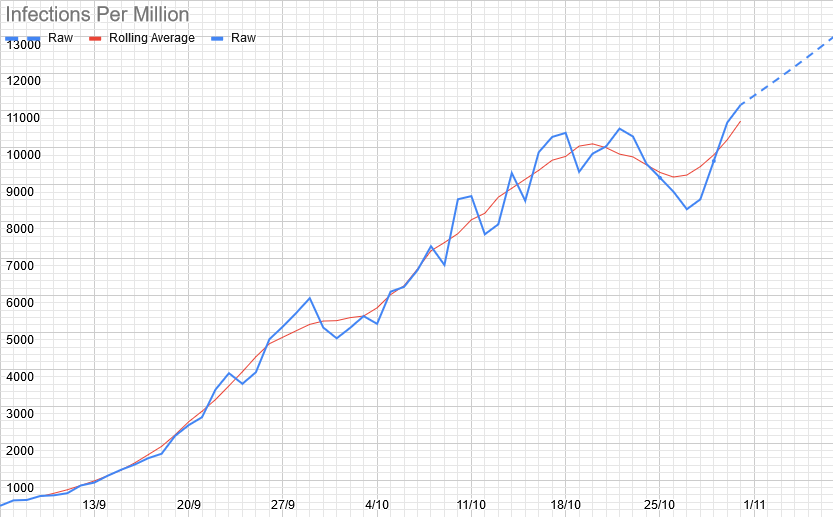
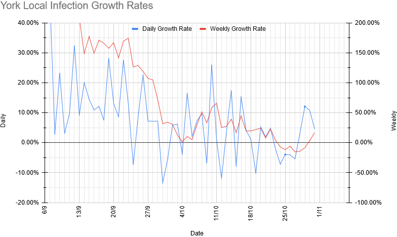
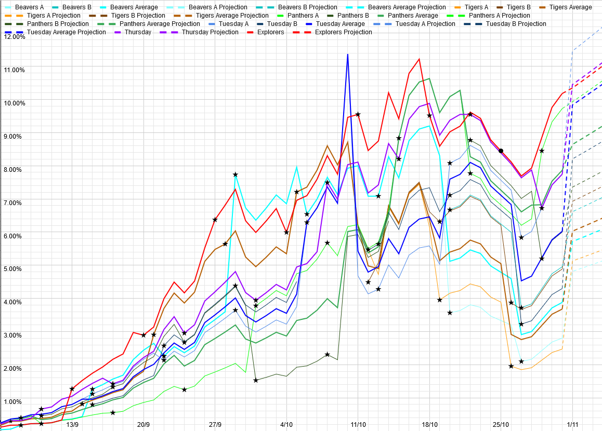

# Covid-19 Update

## The Government Announcement & This Week

As I'm sure most of you have just watched, we're going to be seeing more restrictions from Monday. I can't currently tell whether the law is going to stop us from meeting up in person ("childcare" is on the leaked list of exceptions, but whether we're included in that or not has been inconsistent). Also, we're also bound to follow NYA and Scout Association rules, and as of yet, neither of those has updated us (the latter is waiting for the former, and the former is in discussions with the government, apparently). At this point, I can't say whether or not we will be able to continue meeting. 

If we can, we'd like to, at least at the current risk level, for the same reasons we've mentioned previously: we still think that the actual risk from transmission at our meetings is low compared to the mental health benefits to our members. However, we're also aware that some of you will not agree with that, either because of higher risks to you/your family from the virus, or due to your kids being more able to cope with a lockdown than the average. I'll just take the opportunity to remind you that our online meetings are still continuing, if your kids would like to come to that instead. At present, that's running on Wednesdays (that being the only evening when the leaders aren't busy running other sections/etc.), but if we do have to stop running the other meetings, we will switch back to doing it on the normal section nights. 

Because of the uncertainty and the likelihood of things changing mid-week, **we're going to Zoom for all section meetings this week**. Normal meeting days/times. After that, we'll decide what we're doing based on what the government/NYA/national Scout Association tell us. As a minor point: we've been using my York uni account so far. That will expire on the 10th of November, so if we stay on Zoom (and I rather expect we will), the meeting ID will change at that point. 

Regardless of what happens going forwards, things are likely to be difficult for a lot of your kids going forwards. If there's anything that we can do to help, please let us know. In particular, I'd like to reiterate my offer to talk with anybody who's struggling, or anybody else who might benefit (either in person or virtually as the law/etc. allows), to provide reassurance, answer any questions, generally be someone to talk to who they aren't stuck in a house with all day. 

If they'd rather write their concerns down than talk about it, we have a worrybox form [here](https://stchadsscouts.com/worrybox), or you can just email us at [worrybox@stchadsscouts.com](mailto://worrybox@stchadsscouts.com).

## Local Situation

It's been an odd week, locally. Firstly, a quick note on the figures: on two days this week (Sunday 25th and Thursday 29th), there was no local data update from ZOE. 
I have no idea why. I've set their infection count values to the average of the numbers for the days on either side. The net effect of this is that the figures for 
each of those days (the 24th, 26th, 28th, and 30th) have larger weighting in the 7-day averages than other days, so if one of them is an outlier, it will have an outsize effect on the average. That isn't the case for the 25th, which is pretty well in the middle of the days either side in pretty well every way, but the 30th had a significant spike on it, which could be partially effected by an outlier. Overall, this is still not a massive deal, just be aware that averages between this Thursday and next Thursday are slightly less confident than usual. The effected days are marked with small dots in the graphs below.

The numbers that we have had are also somewhat strange: from Thursday last week through to Tuesday this week, the rolling average of cases fell consistently, with R hovering around 0.9. Over the last two days, things have reversed entirely, with the last two days being the highest infection numbers we've seen since I started tracking it. Since I can't see any particular reason why this would happen, my best guess is that this is some combination of random variation and the model overestimating the effect of the move to Tier 2, and actual infections are somewhere close to holding steady. However, the test result data is showing essentially the same pattern, on the expected delay, which suggests that it *isn't* anything to do with the model. The only thing I can say with any degree of confidence is that the local numbers don't seem to be changing particularly quickly in either direction. 

The 7-day average of growth rates looks less dramatic, though still with a similar pattern. Daily growth rates have been consistently between -3% and +3% for a long while now, significantly lower than we had earlier in the month (when we were briefly above 5%). That translates to R somewhere between 0.88 and 1.12 all week, somewhat lower than last week. 

## Our Risk Profile

Obviously, we aren't actually meeting this week, so I'm going to shift to using *average* attendance numbers going forwards, so I've shifted to assuming full attendance (of those that have been coming to meetings over the last few months) for the numbers below. This has made things look like they spike rather dramatically today, but really it's just that these numbers aren't comparable to last week's numbers. 

| Section  | Current risk | Risk on meeting day (projected) |
| ---      | --- | --- | 
| Beavers A  | 4.7% | 5.1% |
| Beavers B | 6.5% | 7.1% |
| Tigers A | 5.0% | 5.4% |
| Tigers B | 6.8% | 7.2% |
| Panthers A | 9.7% | 11.0% |
| Panthers B | 7.2% | 8.2% |
| Tuesday Scouts A | 11.2% | 12.2% |
| Tuesday Scouts B | 8.0% | 8.7% |
| Thursday Scouts | 10.2% | 11.6% |
| Explorers | 10.1% | 10.6% |

