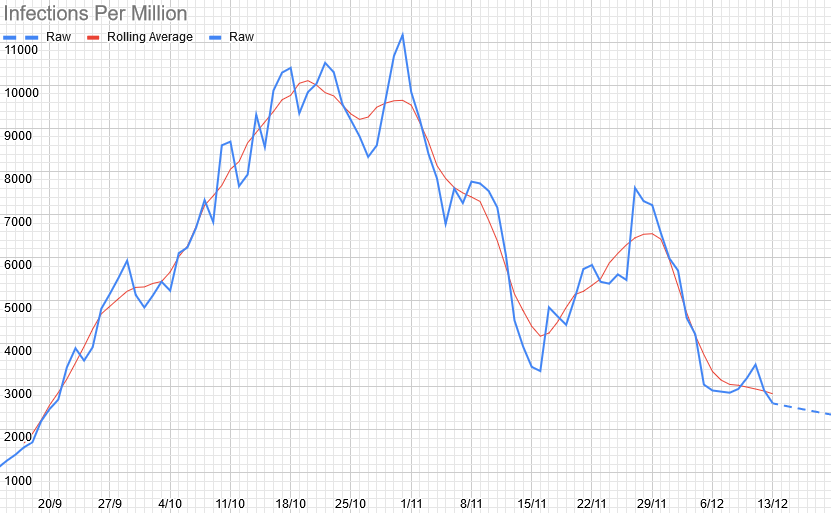
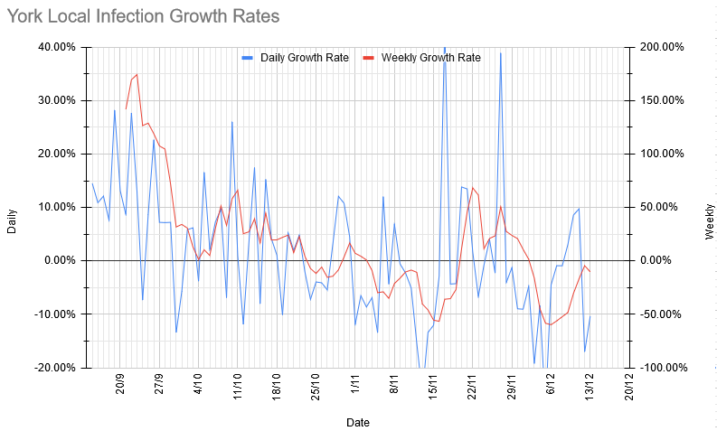
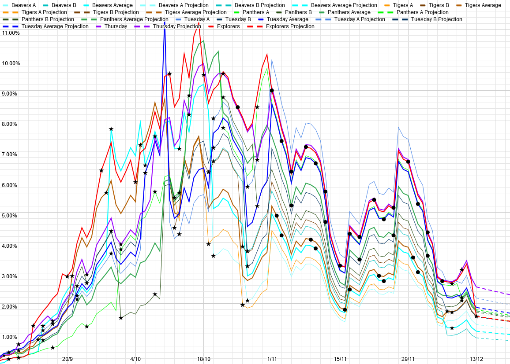

# Weekly Update

## This Week

| Section | Locations | Activity |
| --- | --- | --- |
| Beavers | Clifford's Tower | Chippy/Christmas Lights walk |
| Cubs | Nunnery Lane Car Park/Millennium Bridge | Chippy/Christmas Lights walk |
| Scouts | Clifford's Tower/Nunnery Lane Car Parks | Christmas-y walk |

Uniforms and generally Christmas-y hats/etc. highly recommended.

Finally, Jo will be delivering a bunch of cards/pictures/etc. to a local care home next week. If anybody has any cards/etc. they'd like to add to that, please bring them along to any meeting this week. 

## Local Situation

This week, we've levelled off significantly - this is likely the move to the tier system kicking in. The fact that it's still broadly level or downwards is very good news.

## Our Risk Profile

These are now based on actual attendance last week, so are actually meaningful again. They're also the lowest we've had since September for most sections. 

| Section  | Current risk | Risk on meeting day (projected) |
| --- | --- | --- | 
| Beavers A  | 1.3% | 1.2% |
| Beavers B | 0.9% | 0.8% |
| Tigers (Combined) | 1.6% | 1.5% |
| Panthers A | 1.8% | 1.6% |
| Panthers B | 1.7% | 1.6% |
| Tuesday Scouts A | 2.2% | 2.1% |
| Tuesday Scouts B | 1.6% | 1.5% |
| Thursday Scouts | 2.5% | 2.3% |
| Explorers | 1.6% | 1.5% |

