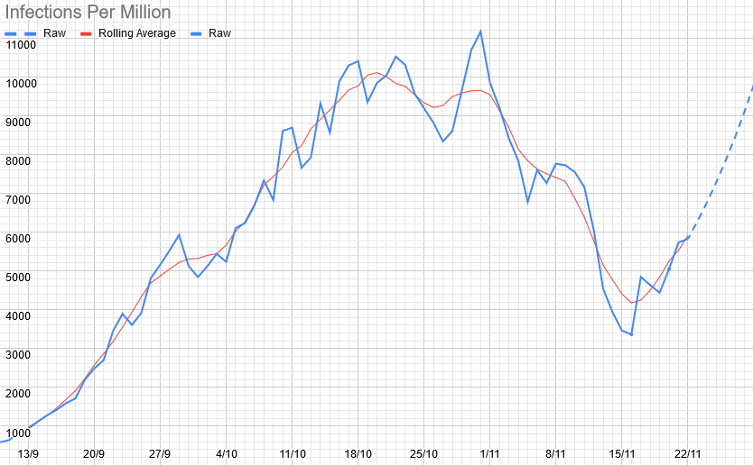
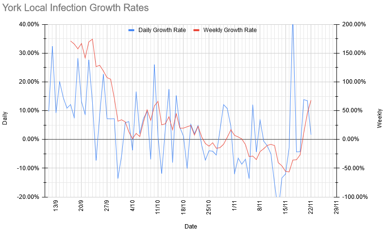
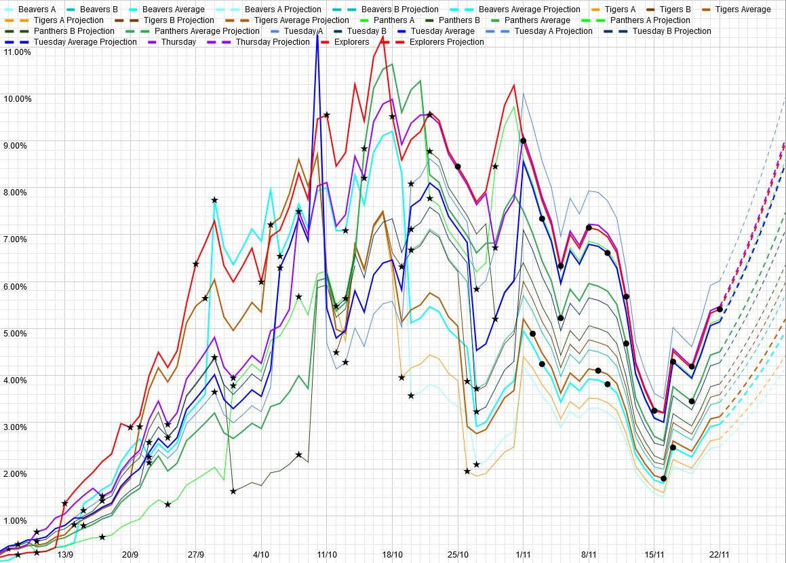

# Weekly Update

## This Week

Here's our Zoom programme for the next week. Our meeting ID and link are the same as last week: [934-691-5877](https://zoom.us/j/9346915877) (link will let you join).

|Section | Activity | Equipment Needed |
| --- | --- | --- |
| Beavers/Cubs | Communicator Badge/Origami | Paper, something to draw with |
| Scouts | RPGs | Pen and paper, dice (or some other way of generating random numbers: [random.org](http://random.org) is good) |
| Explorers | Camouflage & Cake | A camouflaged cake |,

As always, please let us know (either by email, or the [Worry Box](https://stchadsscouts.com/worrybox), or whatever else is easiest) if there's anything we can do to help your kids deal with everything that is going on. 

## Local Situation

In dramatic contrast to last week, cases have started growing again over the last few days. I don't have a good explanation for this, really - the decline lasted upwards of two weeks, so it's unlikely to be half-term effects (but maybe? There could have been some kind of delay before cases started spreading in the areas where it stopped spreading over half term?). My best guess is that it's infections starting to spread from surrounding areas into York (the East Riding/Selby/Leeds/Hull all have much higher prevalences than us, having spiked significantly over the last few weeks). Those areas have since all started to level off or decline, so if my guess is right, I'd hope to see something similar from York over the next week. The change in growth rate corresponds to a shift from R = 0.5 averaged over last week to R = 1.5 averaged over the last week. However, that's a combination of an implausibly huge spike on Tuesday (daily R = 6.9) and two days of rapid-but-plausible growth on Friday and Saturday (daily R 2.0 for both), though, with other days either being negative or essentially flat (daily R between 0.8 and 1.1). The Tuesday spike looks like some kind of a model update to me, so I'd guess that in fact the real numbers were just higher than they looked over last weekend. 

## Our Risk Profile

As with last week, these are theoretical numbers for what would happen if we did meet, and everybody who had been turning up even occasionally did. As those numbers aren't changing, and I haven't updated the age profile (yeah, I know. I'll try to *actually* get it done this week), this is essentially just a scaled version of the above, and shows much the same pattern, with risks across the board having halved again from last week.

| Section  | Current risk | Risk on meeting day (projected) |
| --- | --- | --- | 
| Beavers A  | 2.5% | 3.3% |
| Beavers B | 3.4% | 4.6% |
| Tigers A | 2.6% | 3.3% |
| Tigers B | 3.6% | 4.5% |
| Panthers A | 5.2% | 8.0% |
| Panthers B | 3.8% | 5.9% |
| Tuesday Scouts A | 6.0% | 8.0% |
| Tuesday Scouts B | 4.3% | 5.7% |
| Thursday Scouts | 5.5% | 8.4% |
| Explorers | 5.4% | 6.3% |

