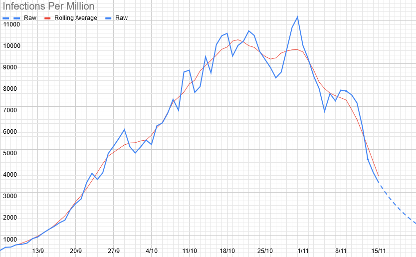
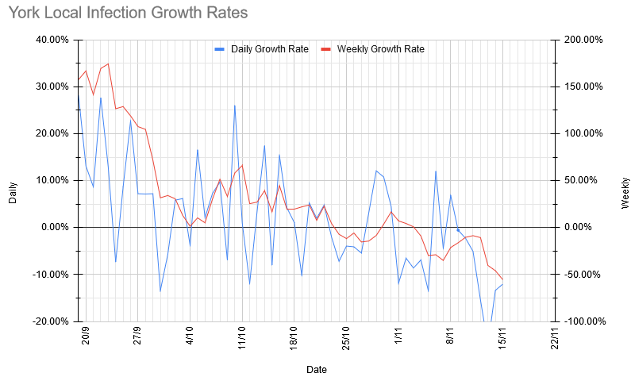
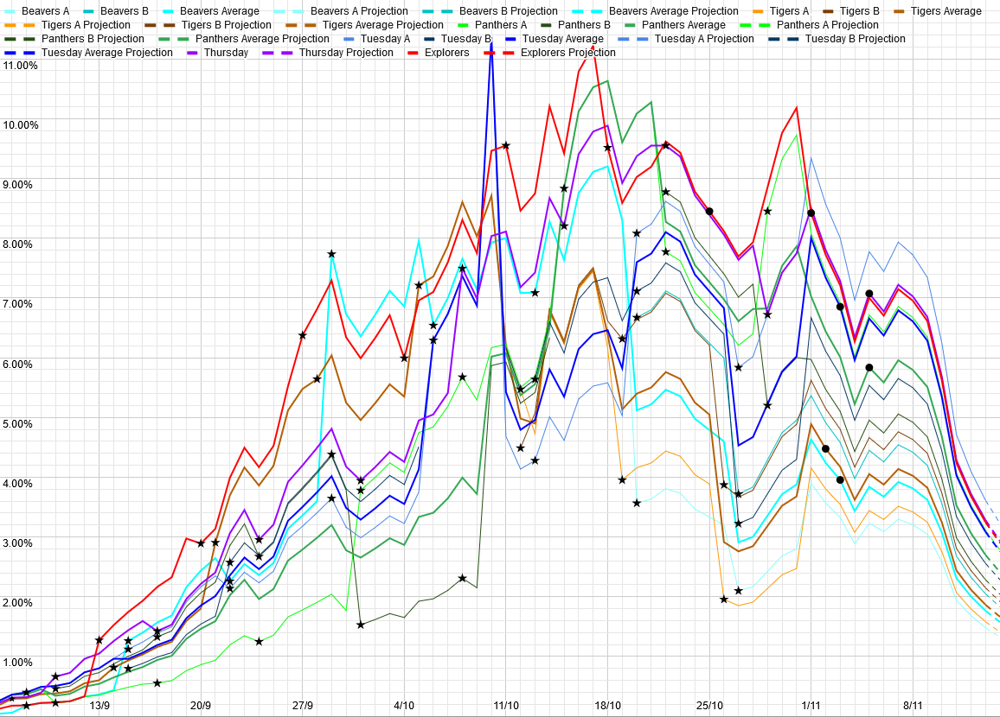

# Weekly Update

## This Week

Here's our Zoom programme for the next week. Our meeting ID and link are the same as last week: [934-691-5877](https://zoom.us/j/9346915877) (link will let you join), and it should stay that way for the next month at least. 

|Section | Activity | Equipment Needed |
| --- | --- | --- |
| Beavers/Cubs | Scavenger Hunt | Nothing in particular |
| Scouts | Cleudo | Pen and paper |
| Explorers | Be Prepared | Be Prepared |

As mentioned last week, please let us know (either by email, or the [Worry Box](https://stchadsscouts.com/worrybox), or whatever else is easiest) if there's anything we can do to help your kids deal with everything that is going on. 

## Local Situation

The local picture looks remarkably positive this week, with infection numbers continuing to drop steeply, now being down to the lowest levels since September. This decline corresponds to a local R of 0.54 (halving time 6 days), down from 0.84 last week (halving time 20 days). This is the first week where the lockdown is likely to be having a significant effect, so it looks like it is working quite dramatically well locally, in a way which makes us very much an outlier compared to the rest of Northern England. 

## Our Risk Profile

As with last week, these are theoretical numbers for what would happen if we did meet, and everybody who had been turning up even occasionally did. As those numbers aren't changing, and I haven't updated the age profile (I have now got a new batch of data from everybody, so it will be updated by next week), this is essentially just a scaled version of the above, and shows much the same pattern, with risks across the board having halved again

| Section  | Current risk | Risk on meeting day (projected) |
| --- | --- | --- | 
| Beavers A  | 1.5% | 0.9% |
| Beavers B | 2.0% | 1.3% |
| Tigers A | 1.6% | 1.1% |
| Tigers B | 2.1% | 1.5% |
| Panthers A | 3.1% | 1.6% |
| Panthers B | 2.3% | 1.1% |
| Tuesday Scouts A | 3.6% | 2.3% |
| Tuesday Scouts B | 2.6% | 1.6% |
| Thursday Scouts | 3.3% | 1.7% |
| Explorers | 3.2% | 2.6% |

