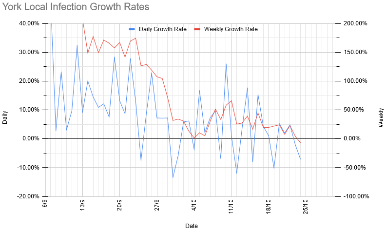
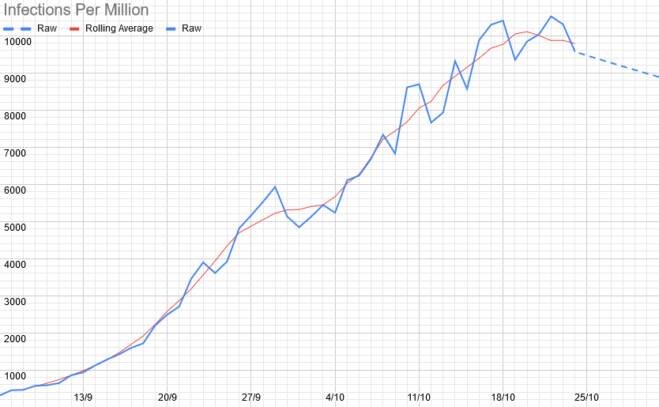
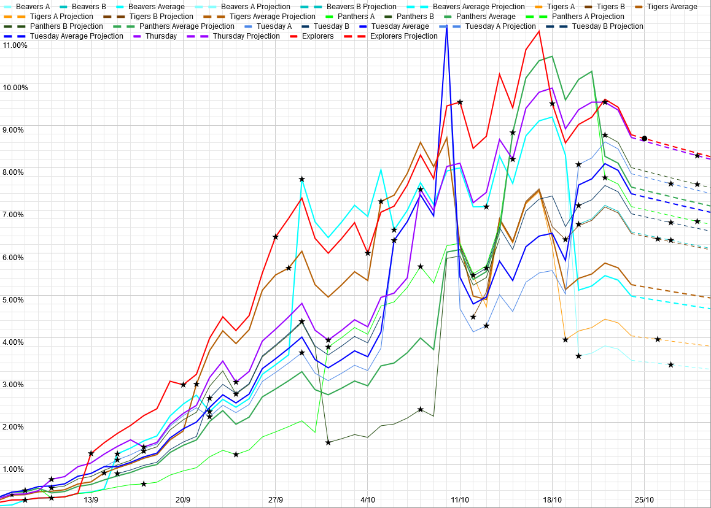

# Covid 19 Update - 10th October

## Local Situation

Some definite good news this week - for the first time since I started tracking the numbers daily, our 7-day rolling average growth rate has dipped negative. It's only slightly negative, and it's entirely possible that it's just random variation and it'll go positive again tomorrow, but it is negative, and corresponds to R = 0.95, which I believe is the lowest it's been since July, and it is certainly a drop off from what we were seeing last week. (You might also notice that I made the graphs go all the way back to the earliest dates I've got data for, rather than just covering the last few weeks).

## Our Risk Profile

The current and projected risks on the day of meeting (assuming growth continues at its 7-day average rate and the same attendance as last week) are as follows: 

| Section  | Current risk | Risk on meeting day (projected) |
| ---      | --- | --- | 
| Beavers A  | 3.5% | 3.3% |
| Beavers B | 6.5% | 6.2% |
| Tigers A | 4.0% | 3.9% |
| Tigers B | 6.5% | 6.3% |
| Panthers A | 7.1% | 6.7% |
| Panthers B | 8.0% | 7.5% |
| Tuesday Scouts A | 7.9% | 7.6% |
| Tuesday Scouts B | 6.9%% | 6.6% |
| Thursday Scouts | 8.7% | 8.2% |
| Explorers | 8.8% | 8.6%* |

\*Meeting virtually this week

On account of the above, our risks for next week are broadly similar to what they were last week, except that:

- With the Beaver groups being split, they've dropped down to being the lowest-risk section (averaged).
- Similarly, with the Thursday sections being split down from two meetings to three, their risks have dropped.
- With the Explorers meeting virtually this week, their actual risk is zero - for this reason, I've marked the meeting on the chart below with a circle rather than a star. 

For comparison, equivalent risk figures for a primary school bubble of 30 are between 20 and 25%, and for a secondary school year bubble of 150, they're around 80%. 

