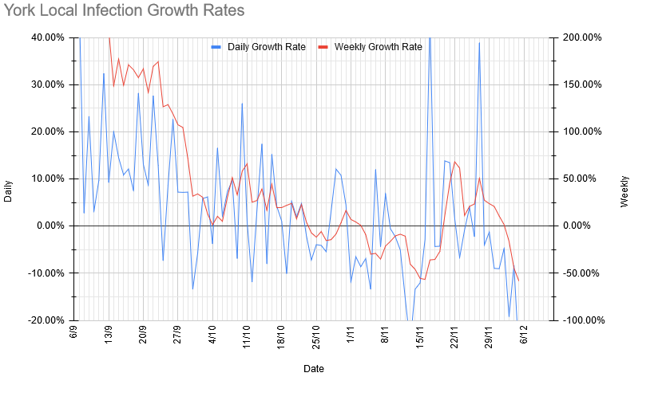
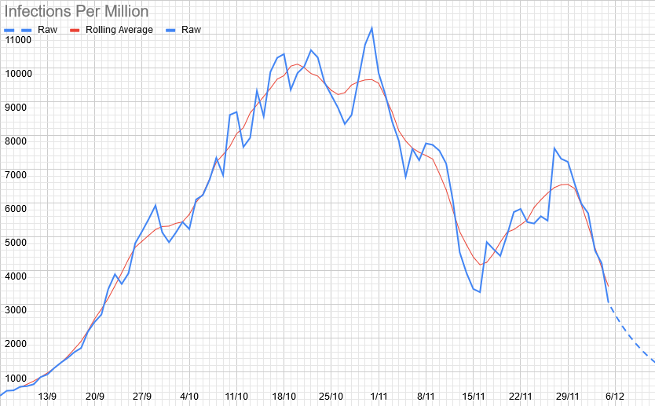
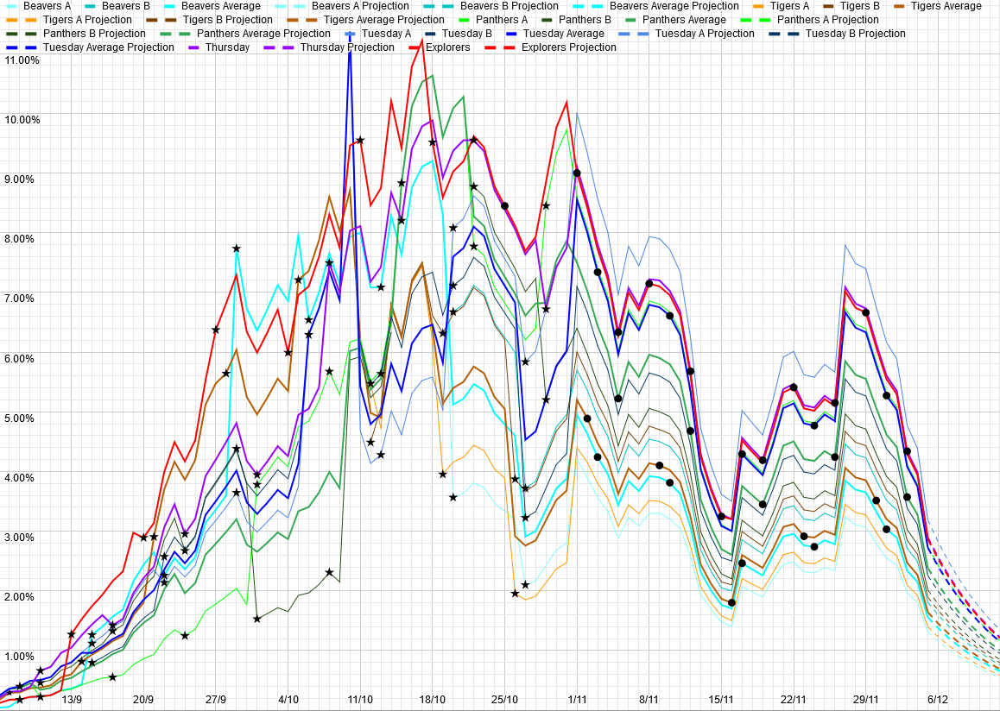

# Weekly Update

## This Week

With the change back to a tier system, we're now allowed to meet up in person again. This week, we're keeping things simple, and going for various walks with all of the sections except Explorers (Explorers, check your facebook group for details). We're likely to have to split at least some of the groups again, so please make sure to sign up on OSM (you should have just had an email about that. We'll all be meeting at the normal times, but in a variety of places: 

| Section | Location | Second location if we need to split |
| --- | --- | --- |
| Beavers | Scout Hut | Knavesmire Entrance |
| Cubs | Scout Hut | Millennium Bridge |
| Tuesday Scouts | Scout Hut | Millennium Bridge |
| Thursday Scouts | Scout Hut | Millennium Bridge | 

We are likely to be short on leaders for some sections if we do need to split them. At a guess, we're likely to need (assuming that we need to split both sets of Cubs and Tuesday Scouts, and have similar-ish numbers to the last time we met up in person): 

- 1 or 2 parent helpers for Monday Cubs
- 1 parent helper for Beavers
- 2 parent helpers for Tuesday Scouts
- 1 parent helper for Thursday Cubs
- 1 parent helper for Thursday Scouts
- 1 adult helper for Explorers (which we think is sorted)

As always, please let us know (either by email, or the [Worry Box](https://stchadsscouts.com/worrybox), or whatever else is easiest) if there's anything we can do to help your kids deal with everything that is going on. 

## Local Situation

We're back to good news this week - looks like whatever was causing the weird spike last week has faded again, whatever it was. We're back to an increasingly rapid fall, with today's daily and rolling average figures both the lowest since September. There's still a few days of delay built into these figures, so it still remains to be seen what effect the move back to the tier system will have. 

## Our Risk Profile

These are back to meaning something non-hypothetical now, but are still based on the same estimates as they have been for the last month, so are still overestimates for the same reasons that they have been.

| Section  | Current risk | Risk on meeting day (projected) |
| --- | --- | --- | 
| Beavers A  | 1.3% | 0.8% |
| Beavers B | 1.8% | 1.1% |
| Tigers A | 1.4% | 1.0% |
| Tigers B | 1.9% | 1.3% |
| Panthers A | 2.7% | 1.3% |
| Panthers B | 2.0% | 1.0% |
| Tuesday Scouts A | 3.2% | 1.9% |
| Tuesday Scouts B | 2.3% | 1.4% |
| Thursday Scouts | 2.9% | 1.4% |
| Explorers | 2.9% | 2.2% |

