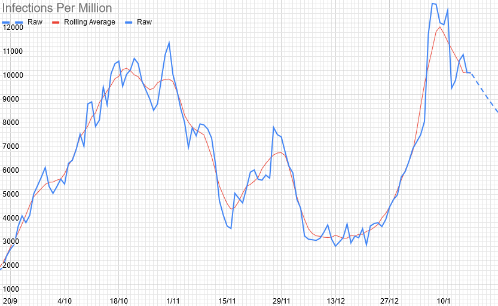
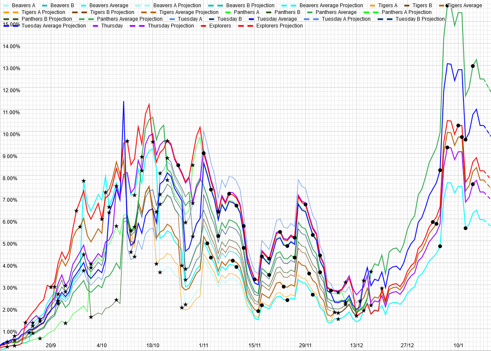

# Weekly Update

## This Week

### For our normal weekly meetings:

**Beavers & Cubs:** We're doing some arty things. You'll need some way of doing art. Microsoft Paint or similar is perfect. 

**Scouts:** We're tying some knots. You'll need something rope-like to tie knots in. 

As always, please let us know if there's anything that we can do to help.

## Local Situation

There's been a lot more instability in the numbers recently, so it's hard to say much with any confidence, but things at least look much less bad than they did last week, matching the testing results. 

<iframe src="https://docs.google.com/spreadsheets/d/e/2PACX-1vS9DCaYpz3qqDbUsptGQO4c-84a3vYQaBk7UtJyolObCJknCxbLY8Zqz3-4EuPindtvnX_6W368Vt3l/pubchart?oid=1771858088&amp;format=interactive"></iframe>

## Our Risk Profile

These are based on the last meeting before Christmas, so still have the slight weirdnesses due to attendance then.

| Section  | Current risk | Risk on meeting day (projected) |
| --- | --- | --- | 
| Beavers (Combined) | 6.0% | 5.4% |
| Tigers (Combined) | 7.8% | 7.2% |
| Panthers (Combined) | 12.4% | 10.7% |
| Tuesday Scouts (Combined) | 10.3% | 9.3% |
| Thursday Scouts | 7.2% | 6.2% |
| Explorers | 8.2% | 7.8% |

