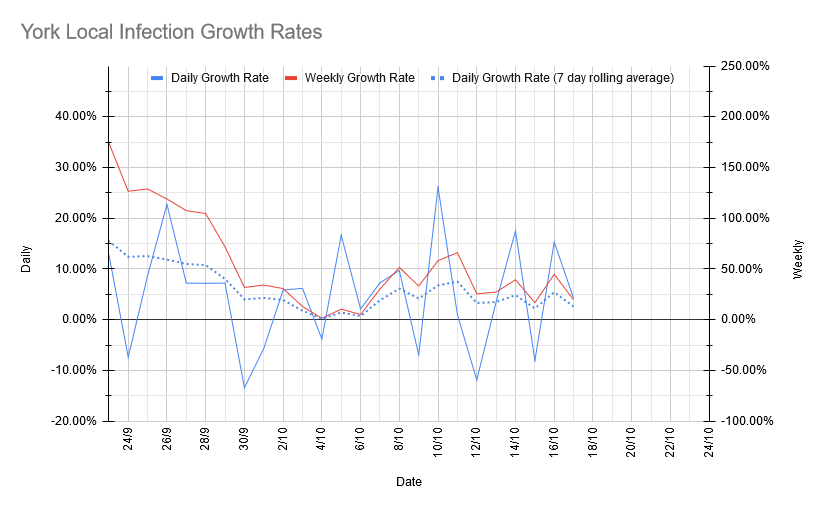
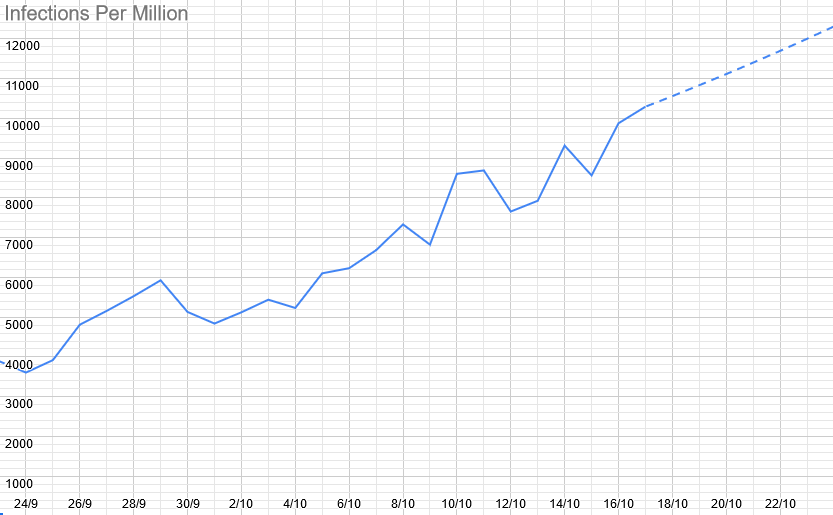
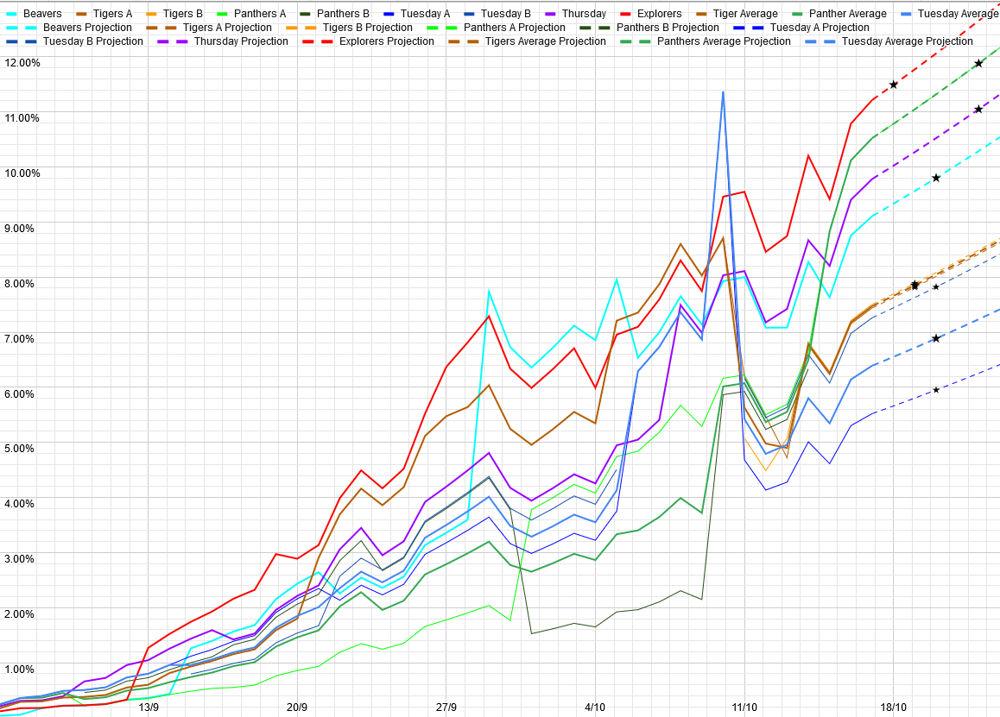

# Covid 19 Update - 10th October

## Local Situation

As you can't have avoided noticing, we're now in "high" on the new tier list. We've also just today edged over 1% active infections by ZOE modelling. Growth rate continues to hover around 5% per day (translating to R between 1.1 and 1.3). This is somewhat lower growth than we saw last week, which has translated to about 600 fewer cases today than we would have had if growth had continued at the same rate. It's also low enough that the minor changes involved in moving to high might actually push it below R = 1, if we're lucky. 

## Our Risk Profile

The current and projected risks on the day of meeting (assuming growth continues at its 7-day average rate and the same attendance as last week) are as follows: 

| Section  | Current risk | Risk on meeting day (projected) |
| ---      | --- | --- | 
| Beavers  | 9.1% | 10.0% |
| Tigers A | 7.4% | 8.0% |
| Tigers B | 7.5% | 8.1% |
| Panthers (Combined) | 10.5% | 12.2% |
| Tuesday Scouts A | 5.5 | 6.1% |
| Tuesday Scouts B | 7.3% | 8.0% |
| Thursday Scouts (inc. some Cubs) | 9.8% | 11.3% |
| Explorers | 11.2% | 11.8% |

In line with the above, our risks have continued to grow from last week - this is pretty well entirely due to the overall growth in case numbers. The risks for Beavers, Panthers, and Thursday Scouts are over-represented here, because they will be split into smaller groups this coming week than they were last week - Beavers will be split in two, while the Thursday sections will go from two groups to three.  The risk of your child actually catching it will be considerably lower than these numbers, but it's hard to say exactly how much lower. Obviously, we'll do what we can to minimise the risk of tranmission, but we can't make them zero. 

For comparison, equivalent risk figures for a primary school bubble of 30 are between 20 and 25%, and for a secondary school year bubble of 150, they're around 80%. 

