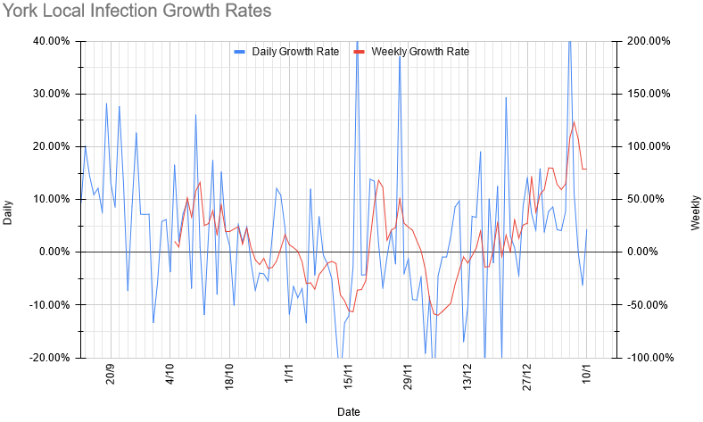
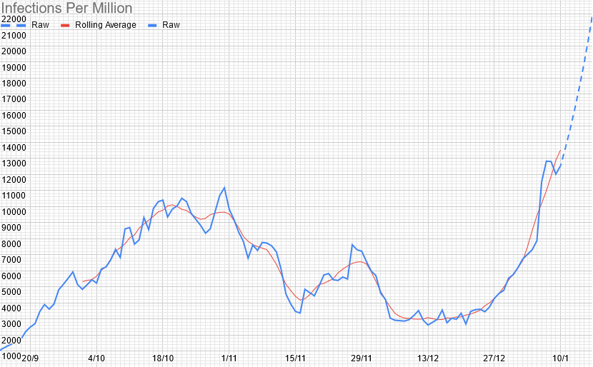
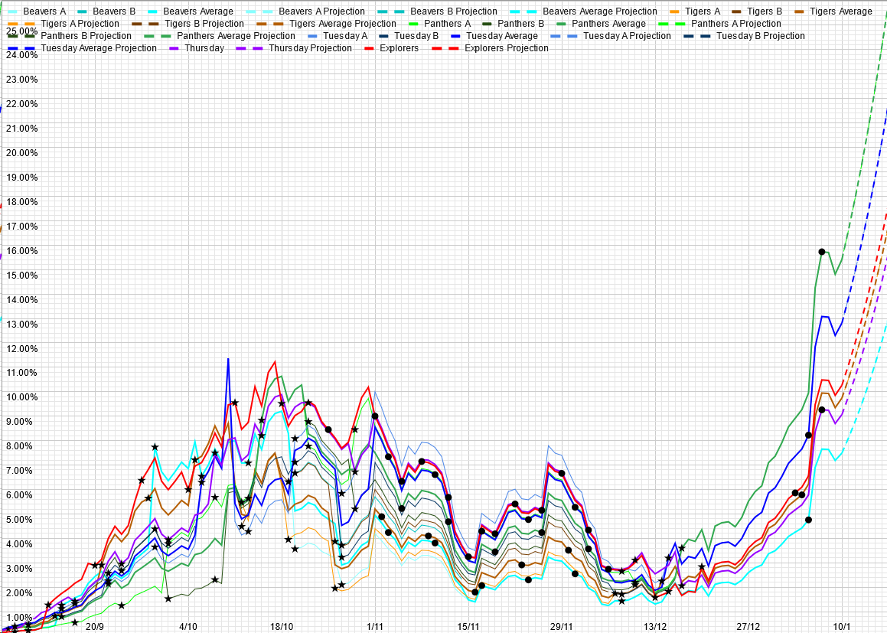

# Weekly Update

## This Week

### For our normal weekly meetings:

**Beavers & Cubs:** Not sure exactly what we're doing, or how to write it, but it won't need anything unusual, so just turn up.

**Scouts:** We're baking. You'll need: 

| Ingredient | Quantity | Notes |
|---|---|---|
|Flour|225g|Hopefully self-raising|
|Sugar|75g|Probably caster|
|Butter|75g|Or margarine|
|Eggs|1| |
|Milk|100ml||
|Bun cases|Some||

Or some multiple thereof.

### Other stuff that's going on

- [Gilwell WinterCamp](https://www.wintercamp.org.uk/) is on next weekend. There's a whole bunch of activities for all ages on there. There's apparently some sort of team challenge on as well, so we'll have a go at that at some point. More details will follow shortly.  
- Would there be any interest in some kind of regular chess thing, now we've got everything set up for it? If so, it'll be either on Wednesday/Friday evenings or somewhere during the weekend, but otherwise, it can go wherever you like, time-wise.

As always, please let us know if there's anything that we can do to help.

## Local Situation

Things have changed rather dramatically, and not in a good direction, unfortunately. Not much to say here other than that. Rolling average R peaked at 1.84 on Thursday, and has since trended down slightly to 1.55.

## Our Risk Profile

These are based on the last meeting before Christmas, so still have the slight weirdnesses due to attendance then.

| Section  | Current risk | Risk on meeting day (projected) |
| --- | --- | --- | 
| Beavers (Combined) | 7.5% | 10.3% |
| Tigers (Combined) | 9.7% | 12.3% |
| Panthers (Combined) | 15.4% | 24.1% |
| Tuesday Scouts (Combined) | 12.8% | 17.4% |
| Thursday Scouts | 9.1% | 14.5% |
| Explorers | 10.3% | 12.0% |

