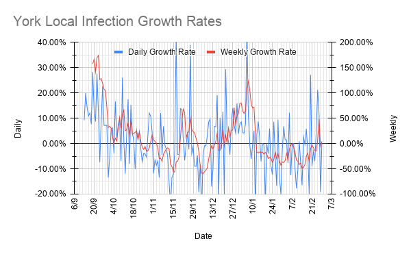
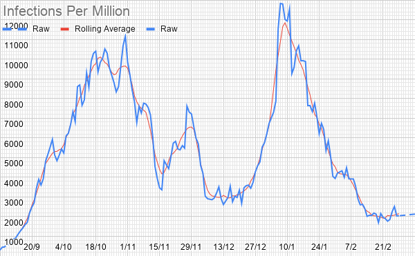
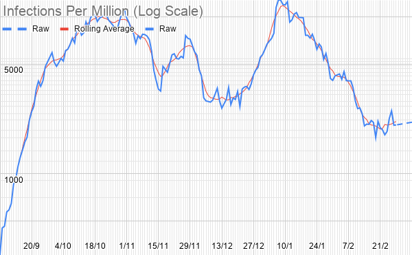
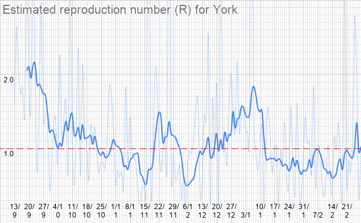

# Weekly Update

## This Week

### For our normal weekly meetings:

**Beavers & Cubs:** Apparently, we're making dens. I don't really know what that involves, but you'll need "something vaguely den-material-ish" and presumably a suitable place to do so. 

**Scouts:** We're doing a much better quiz than last time! Those of you who were there last week were supposed to be writing quiz rounds. Please send them as soon as you can if you haven't already.

## Local Situation

The "vaccines showing up as possible cases" thing from last week has apparently been fixed, but whatever they've changed seems to have thrown off our local figures a bit - they've been bouncing around all over the place ever since the change. I'm assuming it's a sample-size issue, since we're down to a few hundred predicted cases total. At any rate, it's hard to conclude much from this week's figures other than that they don't seem to be changing dramatically quickly.  

[Interactive version](https://docs.google.com/spreadsheets/d/e/2PACX-1vS9DCaYpz3qqDbUsptGQO4c-84a3vYQaBk7UtJyolObCJknCxbLY8Zqz3-4EuPindtvnX_6W368Vt3l/pubhtml?gid=1059409691&single=false)

## Our Risk Profile

No update yet, sorry.
