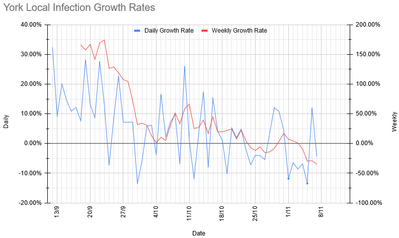

# Weekly Update

## This Week

As expected, we're staying on Zoom for the next four weeks. Programme below. As mentioned last week, we're switching Zoom accounts. The new meeting ID is [934-691-5877](https://zoom.us/j/9346915877) (link will let you join), and it should stay that way for the next month at least. Everything else should be roughly the same as before. 

|Section | Activity | Equipment Needed
| --- | --- | --- |
| Beavers | Music | Something with which to make music. Imaginative interpretations of that encouraged. |
| Cubs | Escape Room | Nothing (something to write on/with might be useful) |
| Scouts | Among Us | Something with Among Us Installed. Links: [PC](https://store.steampowered.com/app/945360/Among_Us/) (£3.99), [iOS](https://apps.apple.com/us/app/among-us/id1351168404) (free), [Android](https://play.google.com/store/apps/details?id=com.innersloth.spacemafia&hl=en_GB&gl=US) (free) |
| Explorers | Taskmaster | Dress code: black tie |

As mentioned last week, please let us know (either by email, or the [Worry Box](https://stchadsscouts.com/worrybox), or whatever else is easiest) if there's anything we can do to help your kids deal with everything that is going on. 

## Local Situation

The local picture looks remarkably positive this week, with the rolling average infections down by nearly a third from their peak last Saturday. Note that since we're using estimates based on symptomatic infections, the incubation period means that this decline represents a drop in infections that happened *before* lockdown started, so there's every reason to expect it to continue or even speed up, going forwards.  

The rolling average growth rate has steadily but consistently dropped over the last week, with the latest value translating to R = 0.72 locally. Again, this is before the effects of the lockdown show up.

## Our Risk Profile

As with last week, these are theoretical numbers for what would happen if we did meet, and everybody who had been turning up even occasionally did. As those numbers aren't changing, and I haven't updated the age profile (due to REACT having not updated since the last time I did it), this is essentially just a scaled version of the above, and shows much the same pattern, with risks across the board at roughly half of last week's figures.

| Section  | Current risk | Risk on meeting day (projected) |
| --- | --- | --- | 
| Beavers A  | 3.1% | 2.4% |
| Beavers B | 4.3% | 3.3% |
| Tigers A | 3.3% | 2.7% |
| Tigers B | 4.5% | 3.7% |
| Panthers A | 6.4% | 4.5% |
| Panthers B | 4.7% | 3.3% |
| Tuesday Scouts A | 7.4% | 5.9% |
| Tuesday Scouts B | 5.3% | 4.2% |
| Thursday Scouts | 6.8% | 4.7% |
| Explorers | 6.7% | 5.9% |

