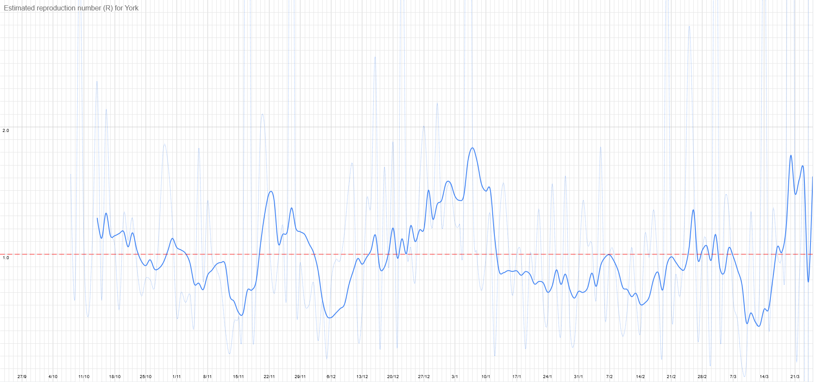

# Weekly Update

## This Week

### For our normal weekly meetings:

We're back in person (and going for a walk). Full details [here](https://covid.stchadsscouts.com/return.html).

## Local Situation
Our local figures have been bouncing around all over the place for the last week, to the point that pretty well any variation would fall within the margin of error, so it's hard to say anything other than that there's a shortage of good data available for York, unfortunately. 

Click the images to expand them, or view the [interactive version](https://docs.google.com/spreadsheets/d/e/2PACX-1vS9DCaYpz3qqDbUsptGQO4c-84a3vYQaBk7UtJyolObCJknCxbLY8Zqz3-4EuPindtvnX_6W368Vt3l/pubhtml?gid=1059409691&single=false).

## Our Risk Profile

This finally got updated. I've also cleaned things up, merging down to a single line per section (light blue: Beavers, brown: Tigers, green: Panthers, dark blue: Tuesday Scouts, purple: Thursday Scouts, red: Explorers). This is still based on the last meeting before Christmas, and has been affected by the messiness of local figures recently, so should be taken with an even larger pinch of salt than usual.

