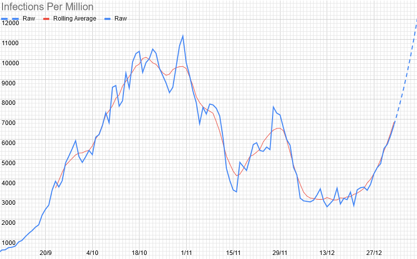

# Weekly Update

## This Week

Given the situation in York (more on that at the bottom), we're going online this week, and seeing what happens (I rather expect we'll move to Tier 4 before long, which would make that compulsory anyway). Specifically, we're doing some chess! The details vary slightly by section: 

**Beavers:** Just turn up, nice and easy.
**Cubs & Scouts:** We're having a tournament. The details for getting into it are marginally complicated, but are below. You might want to do them in advance. (If you can't play chess, don't worry! I'll start with some lessons for anybody that wants them. You might want to sign up anyway: the way the tournament is set up, you can join in part way through without too many problems, or if you'd rather not, we can just play some games without an account). 

## Account Setup

1. Go to [lichess.org](https://lichess.org/)
2. Click "sign in" in the top-right 
3. Click "register" (if you already have an account, for example from the last chess tournament, skip this and just log into your account instead).
4. Fill in the details and hit "register" at the bottom. They don't actually send a confirmation email, so you can put in a fake one if you don't want to give them your real one (but they also haven't sent me any spam). 
5. (Optional) Click on your username in the top-right, and click on "Preferences" in the menu that pops up. The things that are likely to be useful are "board highlights" (Yes), "Piece destinations" (Yes, especially if you aren't too sure about your chess ability), all of the privacy and kid mode settings (as you (the parents) prefer). 
6. On the top-left, go to "Community/Teams". 
7. Click on "All Teams", then type "St Chad's" in the search box on the right. 
8. Click on the only team that comes up (called "St Chad's")
9. Click the big green "Join Team" button. 

In future (after I've let you in), going to Community/Teams will default to a page with a link to St Chad's, and tournaments will appear there when they happen (there's also a forum that you can feel free to organise more games among yourselves in the future, if you'd like). Click on the relevant one for your section (probably also the only one), and click "Join" in the top-right. 

## Local Situation

This week, we've levelled off significantly - this is likely the move to the tier system kicking in. The fact that it's still broadly level or downwards is very good news.

## Our Risk Profile

These are now based on actual attendance last week, so are actually meaningful again. They're also the lowest we've had since September for most sections. 

| Section  | Current risk | Risk on meeting day (projected) |
| --- | --- | --- | 
| Beavers A  | 4.1% | 5.7% |
| Beavers B | 2.2% | 3.1% |
| Tigers (Combined) | 5.3% | 6.8% |
| Panthers (Combined) | 8.6% | 13.8% |
| Tuesday Scouts (Combined) | 7.1% | 9.7% |
| Thursday Scouts | 5.0% | 8.1% |
| Explorers | 5.6% | 6.6% |

