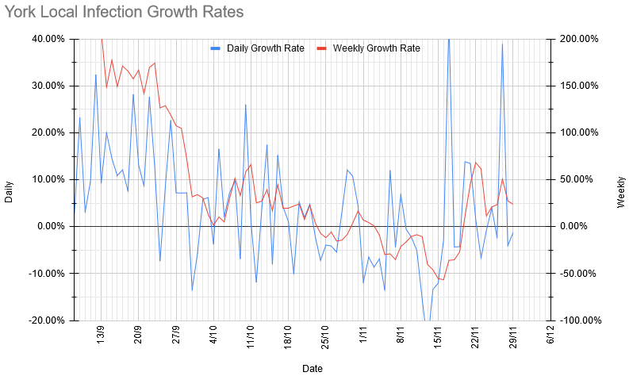

# Weekly Update

## This Week

Here's our Zoom programme for the next week. Our meeting ID and link are the same as last week: [934-691-5877](https://zoom.us/j/9346915877) (link will let you join).

|Section | Activity | Equipment Needed |
| --- | --- | --- |
| Beavers/Cubs | Origami | Paper |
| Scouts | Baking | 250g fat (butter/marg/etc) + some for greasing, 140g sugar (caster/granulated/brown), 1 egg, Vanilla extract or similar (optional), 300g flour (plain or self raising), 125g Icing sugar for decoration |
| Explorers | D&D | Some method of generating random numbers |

As always, please let us know (either by email, or the [Worry Box](https://stchadsscouts.com/worrybox), or whatever else is easiest) if there's anything we can do to help your kids deal with everything that is going on. 

## Local Situation

Things look... weird. I really don't have a good explanation fo why we've seemingly had two days of implausibly ridiculous growth rates, two days of fast but just about plausible growth rates, and otherwise have been pretty much level over the last two weeks, while every other indicator has shown our case rates falling. I'd guess that at least some of the growth is an artifact of modelling changes, but it does look like we've got some actual growth going on, albeit probably slower than it looks. 

## Our Risk Profile

As with last week, these are theoretical numbers for what would happen if we did meet, and everybody who had been turning up even occasionally did. As those numbers aren't changing, and I haven't updated the age profile (yeah, I know. I'll try to *actually* get it done this week), this is essentially just a scaled version of the above, and shows much the same pattern, with risks across the board having halved again from last week.

| Section  | Current risk | Risk on meeting day (projected) |
| --- | --- | --- | 
| Beavers A  | 3.1% | 3.5% |
| Beavers B | 4.2% | 4.8% |
| Tigers A | 3.3% | 3.6% |
| Tigers B | 4.4% | 4.8% |
| Panthers A | 6.4% | 7.6% |
| Panthers B | 4.7% | 5.6% |
| Tuesday Scouts A | 7.4% | 8.3% |
| Tuesday Scouts B | 5.3% | 5.9% |
| Thursday Scouts | 6.7% | 8.0% |
| Explorers | 6.7% | 7.1% |

