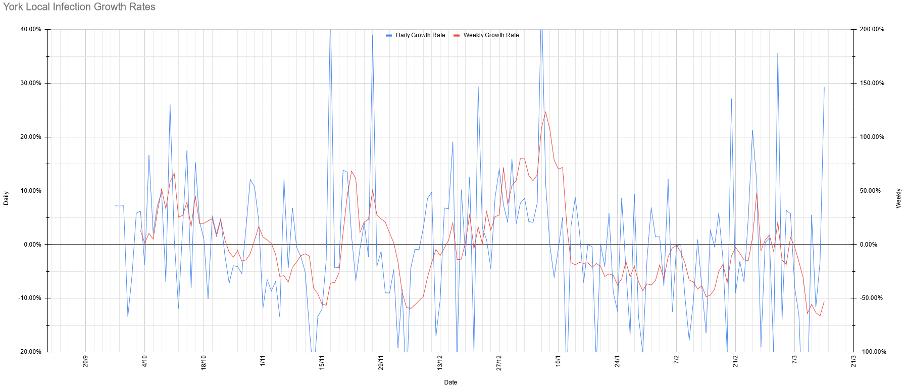

# Weekly Update

## This Week

### For our normal weekly meetings:

**Beavers & Cubs:** We're doing campfire songs. Sorry. They shouldn't need anything in particular (though you might need some earplugs).

**Scouts:** We're doing some D&D. Something to write on and with would be useful, plus dice if you've got them (don't worry if not). 

## Local Situation
Things are looking good locally: we've gone from R bouncing around 1 locally to being very clearly below 1 (somewhere between 0.5 and 0.6). That translates to a clearly visible decline in case numbers, even on the linear scale, and to case numbers roughly halving every week. If this carries on, we'll be getting below the 500 case mark (the point at which I started getting worried about case numbers and tracking things) around this time next week. We are starting to see the random-looking single-day swings that we saw in September again, though, and I expect that will continue, now that we're down to lower numbers again. 

Click the images to expand them, or view the [interactive version](https://docs.google.com/spreadsheets/d/e/2PACX-1vS9DCaYpz3qqDbUsptGQO4c-84a3vYQaBk7UtJyolObCJknCxbLY8Zqz3-4EuPindtvnX_6W368Vt3l/pubhtml?gid=1059409691&single=false).

## Our Risk Profile

No update yet, sorry.
