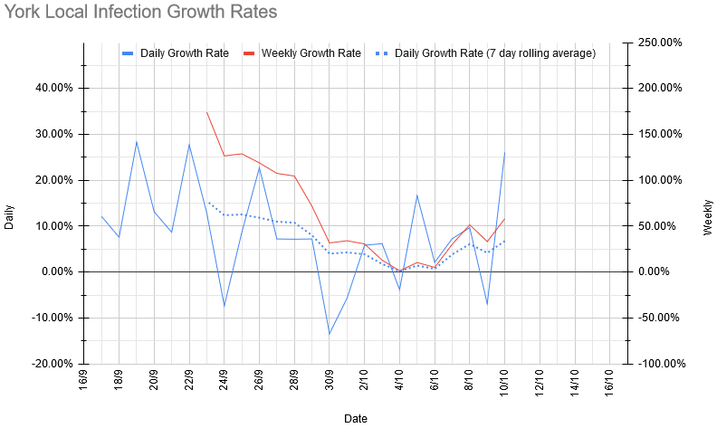
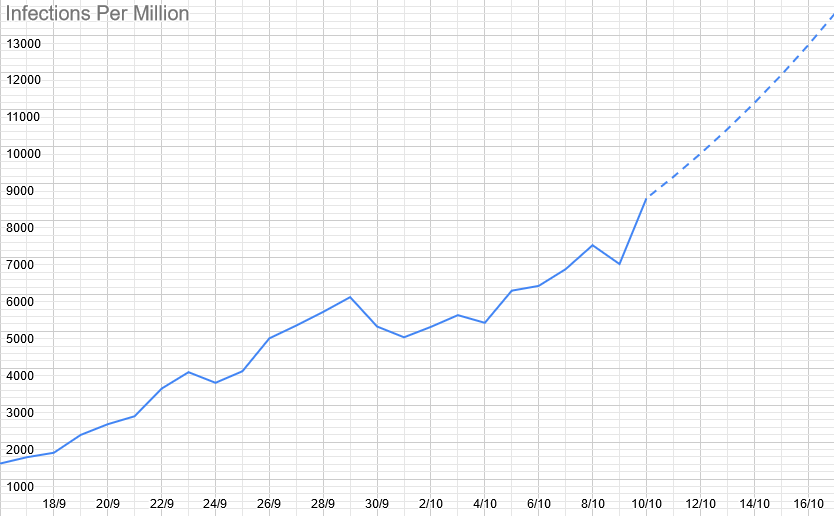

# Covid 19 Update - 10th October

## Local Situation

Growth rates have increased a little since they hit almost zero last week, with the rolling average hovering between 5 and 7% daily growth daily growth (that implies that R is somewhere between 1.2 and 1.3 locally).

That's brought estimated case numbers up to 8,600 cases per million (we'd have been a little under 6,000 if the growth rate had been the same as last week). That's somewhere between 1,600 and 1,700 cases in the city. 

Additionally, new data on the (national) age distribution of cases has come out. Even more usefully, this includes data that splits their age categories in sensible places (so Explorers aren't being included in the same averages as university students any more). However, there has also been a general increase in cases among children, which has lead to general increases in risks across the board. I still suspect our local distribution is somewhat different to the national one (due to the relative lack of outbreaks in our local schools), but the data on that isn't available. 

## Our Risk Profile

The current and projected risks on the day of meeting (assuming growth continues at its 7-day average rate and the same attendance as last week) are as follows: 

| Section  | Current risk | Risk on meeting day (projected) |
| ---      | --- | --- | 
| Beavers  | 7.9% | 10.2% |
| Tigers A | 6.1% | 7.4% |
| Tigers B | 5.0% | 6.1% |
| Panthers A | 6.2% | 9.0% |
| Panthers B | 5.9% | 8.6% |
| Tuesday Scouts A | 4.6% | 6.0% |
| Tuesday Scouts B | 6.1% | 7.9% |
| Thursday Scouts | 8.0% | 11.7% |
| Explorers | 9.5% | 10.7% |

Overall, the risks are quite a bit higher than they were last week (due to a mixture of an increase in cases in York and a growth in cases among secondary-age children in particular), with the sections that haven't split yet at the top, around the 10% mark, and the unsplit sections somewhat below. The risk of your child actually catching it will be considerably lower than these numbers, but it's hard to say exactly how much lower. Obviously, we'll do what we can to minimise the risk of tranmission, but we can't make them zero. 

For comparison, equivalent risk figures for a primary school bubble of 30 are between 15 and 20%, and for a secondary school year bubble of 150, they're around 70%. 

